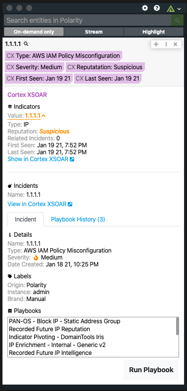
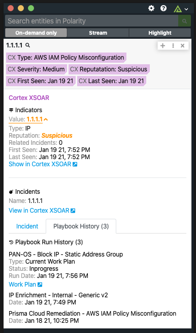
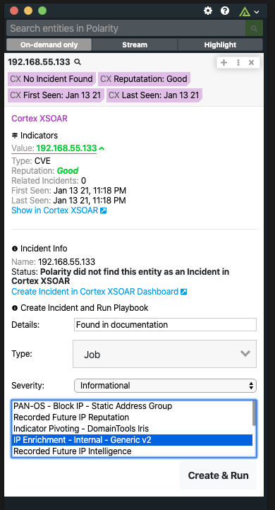
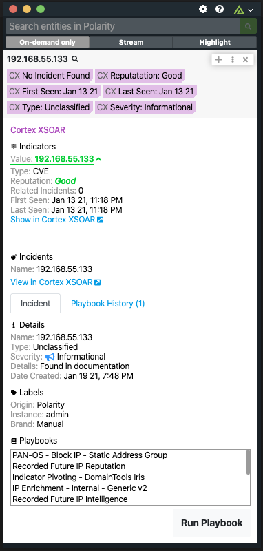
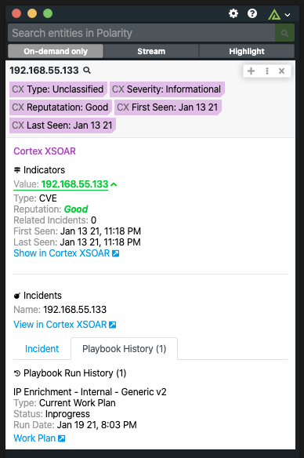
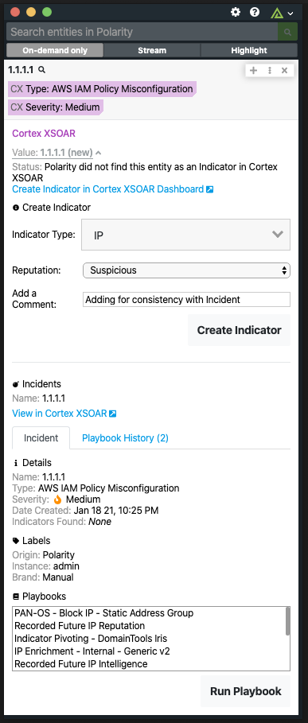

# Cortex XSOAR
### Operating System for Enterprise Security

# Polarity Cortex XSOAR Integration

Polarity's Cortex XSOAR integration allows automated queries against Cortex XSOAR's incident database, create incidents from entities, and allows a user to execute pre-defined playbooks from the Polarity overlay window.

## Normal Incident and Incidator with Playbook History

  
  

## Create New Incident

  
  

  

## Create New Indicator

  
  

> To learn more about Cortex XSOAR, visit the [official website](https://register.paloaltonetworks.com/introducingcortexxsoar).

## Cortex XSOAR Integration Options

### Server URL

The Server URL where the Cortex XSOAR API instance is located.  The Server URL should include the schema (https) and the fully qualified domain name of the Cortex XSOAR server.

### Token

The API token to use to authenticate with the Cortex XSOAR server.  See the official documentation for instructions on setting up an API token.

### Allow Incident Creation

If checked, users will be able create incidents when searching On Demand if there are none currently existing for your searched entity.

## Querying and Creation Details

> There are some current limitations to the integration in relation to the query and creation of Incidicents and Indicators due to some issues with Cortex XSOAR's API.  Currently we are finding that Indicator searches are not exhaustive meaning there could be other indicators in Cortex XSOAR that we are not finding. This is not happening often but is possible.

> Also, when we are creating an Incident using the dashboard we are setting the name of the incident to the Entity's Value and setting a label to Polarity for later reference that the incident was created in Polarity.  We are also running a playbook that you select on the Incident after it is created.

## Installation Instructions

Installation instructions for integrations are provided on the [PolarityIO GitHub Page](https://polarityio.github.io/).

## Polarity

Polarity is a memory-augmentation platform that improves and accelerates analyst decision making.  For more information about the Polarity platform please see:

https://polarity.io/
