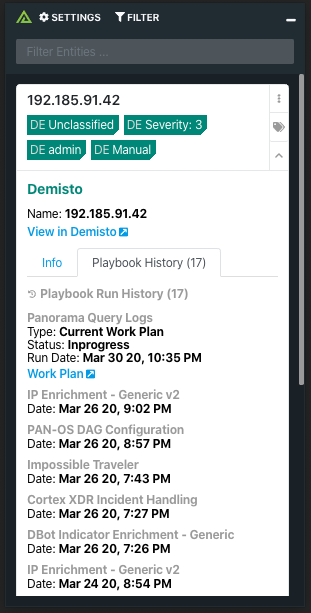
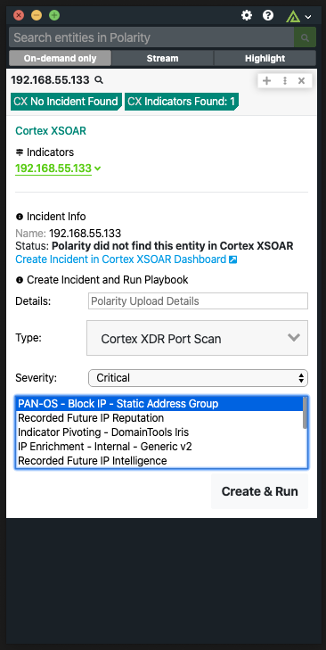
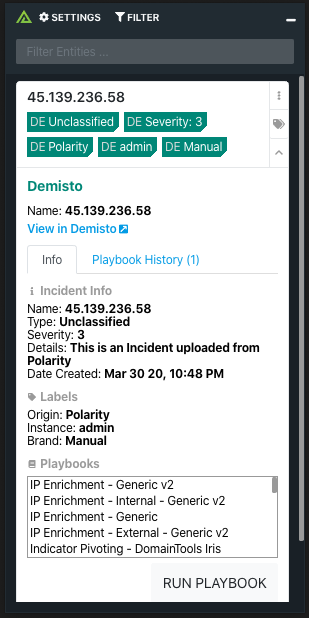

# Demisto
### Operating System for Enterprise Security

# Polarity Demisto Integration

Polarity's Demisto integration allows automated queries against Demisto's incident database, create incidents from entities, and allows a user to execute pre-defined playbooks from the Polarity overlay window.

## Normal Incident with Playbook History

  
  

## Create New Incident

  
  

To learn more about Demisto, visit the [official website](https://www.demisto.com/).

## Demisto Integration Options

### Server URL

The Server URL where the Demisto API instance is located.  The Server URL should include the schema (https) and the fully qualified domain name of the Demisto server.

### Token

The API token to use to authenticate with the Demisto server.  See the official documentation for instructions on setting up an API token.

## Querying and Creation Details

There are some current limitations to the integration in relation to the query and creation of Incidicents and Indicators due to some issues with Demisto's API.  Currently we are finding that Indicator searches are not exhaustive meaning there could be other indicators in Demisto that we are not finding. This is not happening often but is possible.

Also when we are creating an Incident using the dashboard we are setting the name of the incident to the Entity's Value and setting a label to Polarity for later reference that the incident was created in Polarity.  We are also running a playbook that you select on the Incident after it is created.

## Installation Instructions

Installation instructions for integrations are provided on the [PolarityIO GitHub Page](https://polarityio.github.io/).

## Polarity

Polarity is a memory-augmentation platform that improves and accelerates analyst decision making.  For more information about the Polarity platform please see:

https://polarity.io/
