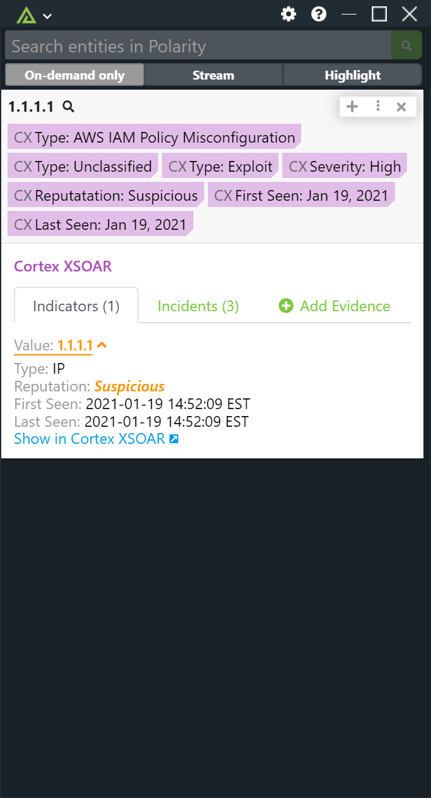
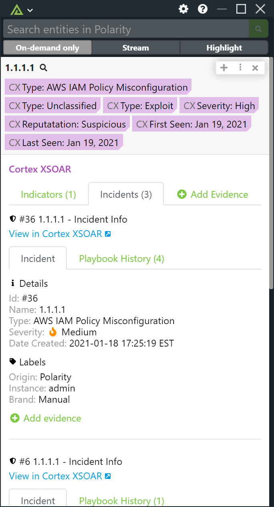
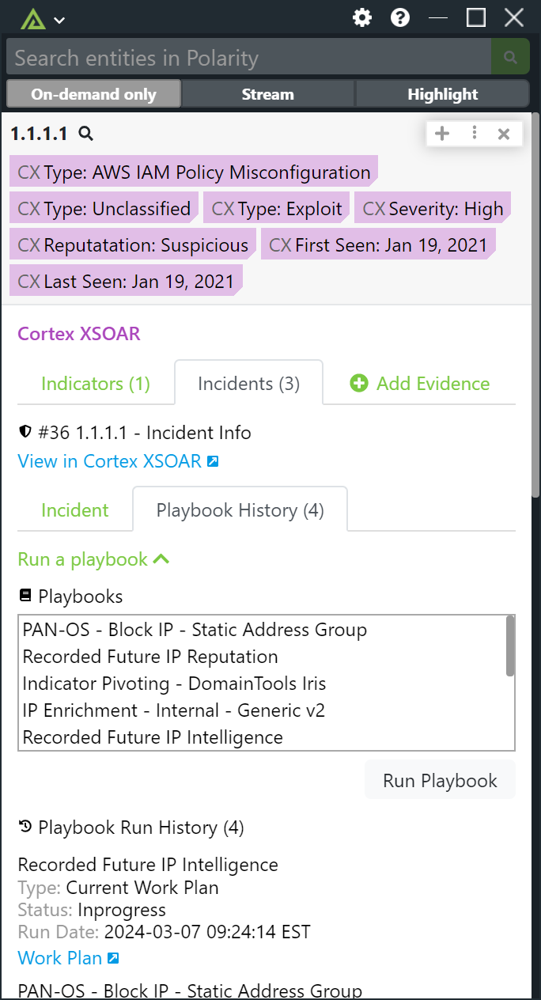
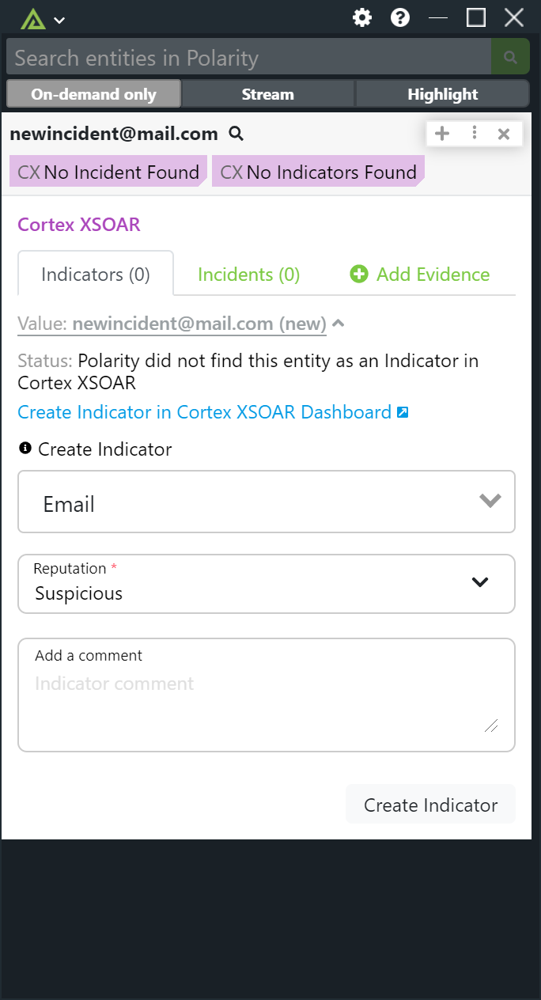
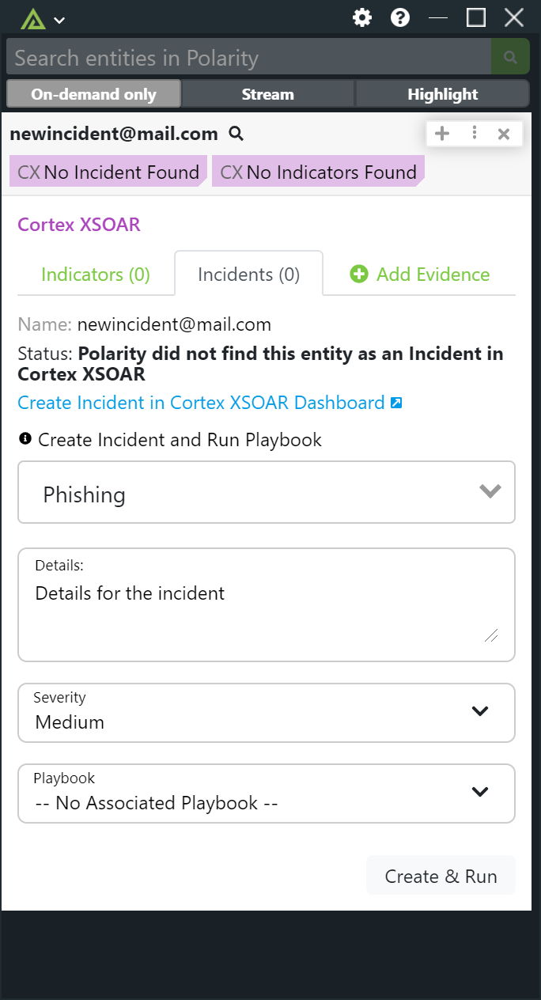
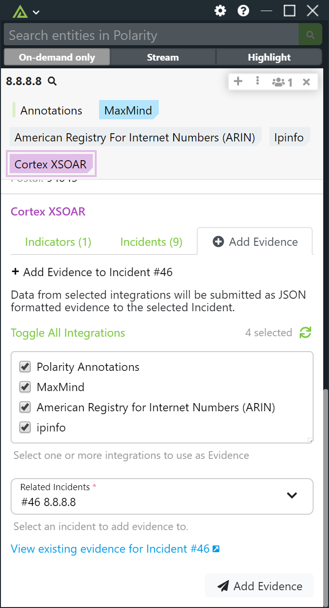

# Cortex XSOAR
### Operating System for Enterprise Security

# Polarity Cortex XSOAR Integration


Polarity's Cortex XSOAR integration searches Cortex XSOAR Incidents, Indicators, and Evidence.  It also supports creating incidents from entities, and allows a user to execute pre-defined playbooks from the Polarity Overlay Window.  Additionally, user's can submit data from other Polarity integrations as evidence for an Incident.  Finally, the integration supports creating indicators from the Overlay Window.

## Search

In order to prevent too many false positives, the integration supports exact match searching of indicators against Incidents, Indicators, and Evidence.

As an example, if you run a search on the domain "mail.com", the integration will return Indicator results for the Domain "mail.com" but will not return Email results for "user@mail.com".  

When searching Evidence, the Cortex XSOAR REST API supports searching the Evidence "description" field.  When searching Incidents, matches are made against the Incident Name as well as Incident Labels.


## Indicator and Incident View with Playbook History
|  |  |              |
|---------------------------|--------------------------|--------------------------------------|
| *View Indicator*          | *View Incident*          | *Run Playbooks and Playbook History* |     

## Create New Indicator/Incident and Add Evidence
|  |  |  |
|----------------------------------|---------------------------------|------------------------------|
| *Create Indicator*               | *Create Incident*               | *Add Evidence to incident*   |     


> To learn more about Cortex XSOAR, visit the [official website](https://register.paloaltonetworks.com/introducingcortexxsoar).


## Cortex XSOAR Integration Options

### Server URL

The Server URL where the Cortex XSOAR API instance is located.  The Server URL should include the schema (https) and the fully qualified domain name of the Cortex XSOAR server.

### API Key

The API token to use to authenticate with the Cortex XSOAR server.  See the official documentation for instructions on setting up an API token. 

> If you are running a multi-tenant deployment, the API key must be generated specifically for the tenant you wish to search. 

### Allow Indicator Creation

If checked, users will be able to create Indicators when searching On Demand if there are none currently existing for your searched entity. This setting must be visible to all users.

### Allow Incident Creation

If checked, users will be able to create incidents when searching On Demand if there are none currently existing for your searched entity.

### Allow Evidence Submissions

If checked, users will be able to submit data from selected Polarity integrations as Incident evidence.  This setting must be visible to all users.

## Querying and Creation Details

> When creating an Incident the Incident's Name is set to the entity's Value and a "Polarity" label is included.  You can optionally run a Playbook upon incident creation.

## Troubleshooting

### Invalid API Key

If you see the following error it typically means the API key is invalid:

```json
{
  "id":"forbidden",
  "status":403,
  "title":"Forbidden",
  "detail":"Issue with CSRF code",
  "error":"http: named cookie not present",
  "encrypted":false,
  "multires":null
}
```

Also ensure the API key is generated for the tenet you wish to search if you have a multi-tenet deployment.

## Installation Instructions

Installation instructions for integrations are provided on the [PolarityIO GitHub Page](https://polarityio.github.io/).


## Polarity

Polarity is a memory-augmentation platform that improves and accelerates analyst decision making.  For more information about the Polarity platform please see:

https://polarity.io/
